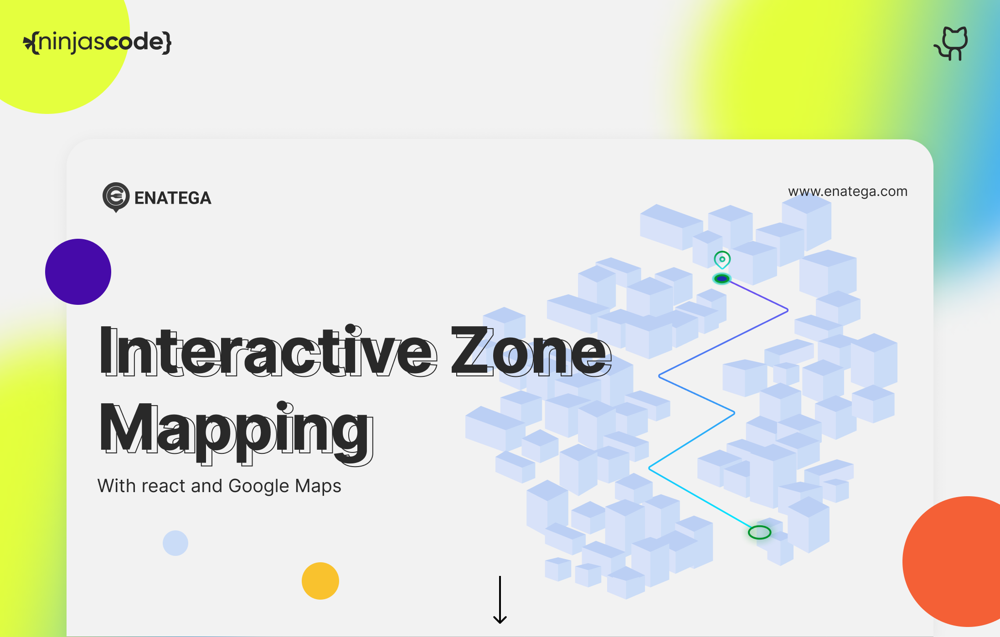
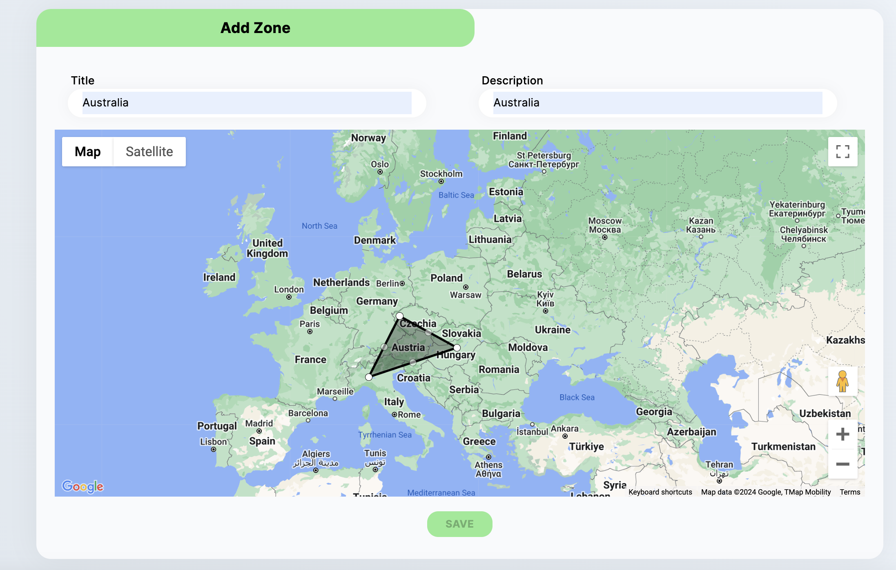

<div align="center">
  <h2>Interactive Zone Mapping with Google Maps API</h2>
</div>

<div align="center">

  [](https://www.youtube.com/@ninjascode509)
  [](https://enatega.com)

</div>

<div align="center">

  [](https://www.facebook.com/enategam) 
  [](https://www.instagram.com/enategam/)
  [](http://linkedin.com/company/enatega)

</div>

<div align="center">

  <a href="https://www.youtube.com/watch?v=00voqzkFpHU">
    
  </a>

</div>

## 🔥 Introduction

This guide demonstrates the process of building a geolocation enabled zones mapping module using React and the Google Maps API. The objective is to enable users to create, edit, and delete delivery zones on the map.

## ⏮️ Prerequisites

Before proceeding, make sure you have the following:

1. Basic knowledge of HTML, CSS, and JavaScript.
2. Node.js and npm installed on your machine.
3. A Google Maps API key.

## 🔂 Getting Started

### 1. Create a new React app:

```bash
npx create-react-app map-app
cd map-app
```

### 2. Install dependencies:

Install the required dependencies for Google Maps:

```bash
npm install @react-google-maps/api
```

## 🗺️ Setting up the Interactive Map

### 1. Obtain a Google Maps API Key:

Obtain a Google Maps API key by following the [official documentation](https://developers.google.com/maps/documentation/javascript/get-api-key)

### 2. Implementing the Map Container:

Create the MapContainer component. This component will handle map interactions, zone creation, and editing.

```bash
const MapContainer = ({ zones, setZones }) => {
  const [map, setMap] = useState(null);
  const [drawing, setDrawing] = useState(false);
  const [newZone, setNewZone] = useState([]);

  const handleMapLoad = (map) => {
    setMap(map);
  };

  const handleMapClick = (e) => {
    if (drawing) {
      setNewZone((prevZone) => [...prevZone, { lat: e.latLng.lat(), lng: e.latLng.lng() }]);
    }
  };

  const handleStartDrawing = () => {
    setDrawing(true);
    setNewZone([]);
  };

  const handleFinishDrawing = () => {
    setDrawing(false);

    // Save the drawn zone to state
    setZones((prevZones) => [...prevZones, { name: 'New Zone', description: 'Description', polygon: newZone }]);

    // Optionally, you can save the zones to local storage here
    // localStorage.setItem('zones', JSON.stringify([...prevZones, { name: 'New Zone', description: 'Description', polygon: newZone }]));

    setNewZone([]);
  };

  return (
    <div className="container">
      <h1>Add ZONE</h1>
      <LoadScript googleMapsApiKey="YOUR_GOOGLE_MAPS_API_KEY">
        <GoogleMap
          id="map"
          mapContainerStyle={{ height: '400px', width: '100%' }}
          zoom={8}
          center={{ lat: 0, lng: 0 }}
          onLoad={handleMapLoad}
          onClick={handleMapClick}
        >
          {drawing && <Polygon path={newZone} options={{ fillColor: '#00FF00', fillOpacity: 0.35 }} />}
        </GoogleMap>
      </LoadScript>

      {/* ... (other UI elements) */}
    </div>
  );
};

export default MapContainer;
```

<div align="center">

  <a href="https://www.youtube.com/watch?v=00voqzkFpHU">
    
  </a>

</div>

### ➗ Let's break down the zone creation functions:

**handleMapLoad Function:**

This function is triggered when the Google Map is loaded. It sets the map state to the loaded map instance.

**handleMapClick Function:**

This function is triggered when the map is clicked. If the drawing state is true, it adds a new point (latitude and longitude) to the newZone state array.

**handleStartDrawing Function:**

This function sets the drawing state to true and initializes an empty newZone array when the user wants to start drawing a new zone.

**handleFinishDrawing Function:**

This function is called when the user finishes drawing a zone. It sets the drawing state to false, adds the drawn zone (with a default name, description, and polygon) to the zones state array, and optionally saves the zones to local storage.

**These functions work together to enable the creation of new zones on the map by clicking and dragging. The drawn zones are then saved to the state or local storage for later use.**

## 📈 Learn More:

This map functionality is used in our full fledged project Enatega; explore this project to learn more.
Learn more about the Google Maps API to incorporate advanced functionalities by visiting our Multivendor repo: [Food-delivery-multivendor](https://github.com/ninjas-code-official/food-delivery-multivendor)

## 🌐 Contact Us:

To acquire the backend license of the full solution go to [Enatega](https://enatega.com/).
